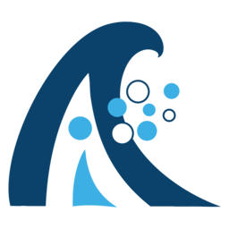

<div align="center">
  

  <h1>AQUAVIEW MCP</h1>

  <p><b>Query 700,000+ ocean & atmospheric datasets from inside Claude, ChatGPT, Gemini, Cursor, and any MCP client — no API keys, no schemas, no glue code.</b></p>

  <p>
    <a href="https://aquaview.org">Homepage</a> ·
    <a href="https://aquaview.org/mcp-overview">MCP Overview</a> ·
    <a href="#install-in-30-seconds">Install</a> ·
    <a href="#try-these-prompts">Prompts</a> ·
    <a href="examples/">Examples</a> ·
    <a href="notebooks/">Notebooks</a> ·
    <a href="docs/">Docs</a>
  </p>

  <p>
    <a href="https://opensource.org/licenses/MIT"></a>
    <a href="https://modelcontextprotocol.io"></a>
    <a href="https://aquaview.org/mcp-overview"></a>
    <a href="docs/collections.md"></a>
  </p>
</div>

---

## What is AQUAVIEW MCP?

AQUAVIEW MCP is a hosted [Model Context Protocol](https://modelcontextprotocol.io) server that gives any LLM agent direct, structured access to a unified catalog of **700,000+ oceanographic, atmospheric, and marine datasets** drawn from **68 authoritative sources** — NOAA, all 11 IOOS Regional Associations, the World Ocean Database, the Global Argo array, GOES-R satellites, NEXRAD weather radar, ESA Sentinel, IFREMER, EMODnet, Ocean Networks Canada, and more.

Ask in plain English. AQUAVIEW finds, filters, aggregates, and returns the data — including direct download links to NetCDF, GRIB2, GeoTIFF, and CSV files where they exist.

> *"Find me all NDBC buoys in the Gulf of Mexico that recorded wave heights over 6 meters during Hurricane Ian in September 2022, and give me their data files."*

The model uses AQUAVIEW's tools to scope by collection, bounding box, and time, apply CQL2 filters on per-variable statistics, and stream back STAC items with assets.

## Install in 30 seconds

The AQUAVIEW MCP server is hosted at **`https://mcp.aquaview.org/mcp`** (HTTP transport). No installation. No keys.

### Claude Code

```bash
claude mcp add --transport http aquaview https://mcp.aquaview.org/mcp
```

### Claude Desktop

`Settings → Developer → Edit Config` and merge:

```json
{
  "mcpServers": {
    "aquaview": {
      "type": "http",
      "url": "https://mcp.aquaview.org/mcp"
    }
  }
}
```

### Cursor

`Settings → MCP → Add new MCP Server`, paste the URL above, type `http`.

### ChatGPT, Gemini, OpenAI Agents SDK, Anthropic API direct, and more

See **[INSTALL.md](INSTALL.md)** for every supported client.

## Try these prompts

Drop these into any MCP-enabled chat to see AQUAVIEW in action:

| # | Prompt | Sources used |
|---|---|---|
| 1 | Show me sea surface temperature near the Florida Keys for the last 7 days. | `COASTWATCH`, `NDBC`, `COOPS` |
| 2 | Plot the track and intensity of Hurricane Ian using buoy and satellite data. | `NDBC`, `GOES_R`, `NOAA_AOML_HDB` |
| 3 | Find Argo float profiles within 200 km of Hawaii in March 2026 with min pressure under 10 dbar. | `GADR` |
| 4 | What's the current tide and storm surge forecast for Charleston, SC? | `COOPS`, `NOS_COOPS` |
| 5 | Map HF radar surface currents off the California coast right now. | `IOOS_HFRADAR`, `CENCOOS`, `CALOOS` |
| 6 | Give me all active glider missions in the Mid-Atlantic Bight. | `IOOS`, `MARACOOS` |
| 7 | How has Arctic sea-ice extent changed over the last 5 years? | `POLARWATCH` |
| 8 | List ROV dives by NOAA Okeanos Explorer with deep-sea video. | `HYPERION`, `SEATUBE` |
| 9 | Show me all oil-spill incident reports along the Gulf Coast since 2020. | `INCIDENT_NEWS`, `NOAA_ORR` |
| 10 | Vessel traffic density in the approaches to the Port of Long Beach. | `MARINECADASTRE_AIS` |

Walkthroughs of each are in **[`examples/`](examples/)**.

## Sources at a glance

68 collections, grouped. Full table with bbox/temporal coverage and variable lists in **[`docs/collections.md`](docs/collections.md)**.

| Group | Collections |
|---|---|
| **NOAA core** | `NOAA`, `NDBC`, `COOPS`, `NOS_COOPS`, `COOP`, `BATHYMETRY`, `DIGITALCOAST`, `MARINECADASTRE_AIS`, `INCIDENT_NEWS`, `NOAA_ORR`, `HYPERION` |
| **NOAA satellite & weather** | `GOES_R`, `HRRR`, `NEXRAD`, `NEXRAD_L2`, `COASTWATCH`, `COASTWATCH_CWCGOM`, `COASTWATCH_WC`, `POLARWATCH` |
| **NOAA labs & programs** | `PMEL`, `PMEL_GENERIC`, `GLERL`, `NOAA_GLERL`, `NOAA_AOML_HDB`, `NOAA_GDP`, `GADR`, `UAF`, `GOOS` |
| **NOAA NMFS fisheries** | `AFSC`, `NEFSC`, `NWFSC`, `PIFSC`, `SEFSC` |
| **IOOS Regional Associations** | `AOOS`, `CALOOS`, `CARICOOS`, `CDIP`, `CENCOOS`, `GLOS`, `IOOS`, `IOOS_HFRADAR`, `IOOS_OFFICE`, `IOOS_SENSORS`, `MARACOOS`, `NANOOS`, `NERACOOS`, `PacIOOS`, `SECOORA` |
| **International** | `APDRC`, `BCODM`, `CORIOLIS`, `IFREMER`, `EMODNET_PHYSICS`, `MARINE_IRELAND`, `SEATUBE`, `VOICE_OF_THE_OCEAN` |
| **Universities & research** | `OOI`, `OOI_GOLDCOPY`, `NWEM`, `SALISH_SEA_UBC`, `SPRAY`, `GCOOS_HIST`, `WOD` |
| **Global satellite imagery** | `sentinel-1-grd`, `sentinel-2-l2a`, `hls2-l30`, `esa-worldcover` |

## Tools

AQUAVIEW exposes four MCP tools. Full schemas in **[`docs/tools-reference.md`](docs/tools-reference.md)**.

| Tool | Purpose |
|---|---|
| `list_collections` | Enumerate all 68 sources with bbox, temporal extent, keywords |
| `search_datasets` | Free-text + spatial + temporal + CQL2 search across the unified STAC catalog |
| `aggregate` | Counts, geohash heatmaps, per-collection breakdowns, datetime histograms |
| `get_item` | Fetch a single STAC item with full properties and asset download URLs |

The catalog is built on the [STAC](https://stacspec.org/) specification, so items, properties, and assets follow a stable, well-documented schema.

## Examples

Twenty-one walkthroughs in **[`examples/`](examples/)**, each a self-contained scenario with the prompt, a real transcript, the result, and variations to try.

Highlighted:

- [`02-sea-surface-temperature/`](examples/02-sea-surface-temperature/) — SST near a region using CoastWatch + WOD + buoys
- [`03-hurricane-tracking/`](examples/03-hurricane-tracking/) — track + intensity from AOML, GOES-R, NDBC, GDP
- [`05-argo-float-profiles/`](examples/05-argo-float-profiles/) — temperature/salinity profiles from the global Argo array

## Notebooks

Three Jupyter notebooks in **[`notebooks/`](notebooks/)** showing AQUAVIEW MCP through the native agent connectors of each major LLM provider:

- `01-claude-mcp-agent.ipynb` — Anthropic Python SDK with `mcp_servers` parameter
- `02-chatgpt-mcp-agent.ipynb` — OpenAI Agents SDK with hosted MCP tool
- `03-gemini-mcp-agent.ipynb` — Google Gemini Agent SDK with MCP tool

Each notebook asks the same research question (Argo float profiles around Hawaii) so you can compare how each agent reasons over the same catalog.

## How it works

```
   ┌─────────────────────────┐         ┌──────────────────────────┐
   │  Claude / ChatGPT /     │         │   AQUAVIEW MCP Server    │
   │  Gemini / Cursor /      │ ──HTTP─▶│   mcp.aquaview.org/mcp   │
   │  any MCP client         │         │                          │
   └─────────────────────────┘         │  list_collections        │
                                       │  search_datasets         │
                                       │  aggregate               │
                                       │  get_item                │
                                       └────────────┬─────────────┘
                                                    │
                                                    ▼
                              ┌──────────────────────────────────────┐
                              │  Unified STAC catalog (700K+ items)  │
                              │  spanning 68 collections             │
                              └──────────────────────────────────────┘
                                                    │
                  ┌────────────┬────────────────────┼────────────────────┬─────────────┐
                  ▼            ▼                    ▼                    ▼             ▼
              NOAA ERDDAP  IOOS RAs           World Ocean DB        Argo / GADR    Sentinel /
              CoastWatch   NDBC / CO-OPS      Global Drifter        OOI / IFREMER  GOES-R /
              GOES-R       MARACOOS, ...      Program (GDP)         EMODnet, ONC   NEXRAD, ...
```

The server speaks the [STAC API](https://stacspec.org/) under the hood. `search_datasets` compiles your natural-language scope into a CQL2 filter; `aggregate` runs server-side bucket queries so the LLM never has to fetch raw items just to count them.

## Roadmap

- More example walkthroughs (target: 30+)
- Reference integrations: LangChain, LlamaIndex, AutoGen, Mastra
- Per-source quickstart pages
- A "build your own MCP-powered ocean app" tutorial

## Contributing

Examples, prompt recipes, and integration guides are very welcome — see [`CONTRIBUTING.md`](CONTRIBUTING.md). Bug reports and source-coverage requests go in [Issues](../../issues).

## License

[MIT](LICENSE) © 2026 AQUAVIEW.

---

<sub>**Keywords**: MCP server, Model Context Protocol, ocean data, atmospheric data, NOAA, NDBC, IOOS, World Ocean Database, Argo, GOES-R, NEXRAD, CoastWatch, ERDDAP, STAC, Claude, ChatGPT, Gemini, Grok, Cursor, AI agents, LLM tools, oceanography, climate data, marine data, satellite imagery, Sentinel.</sub>
